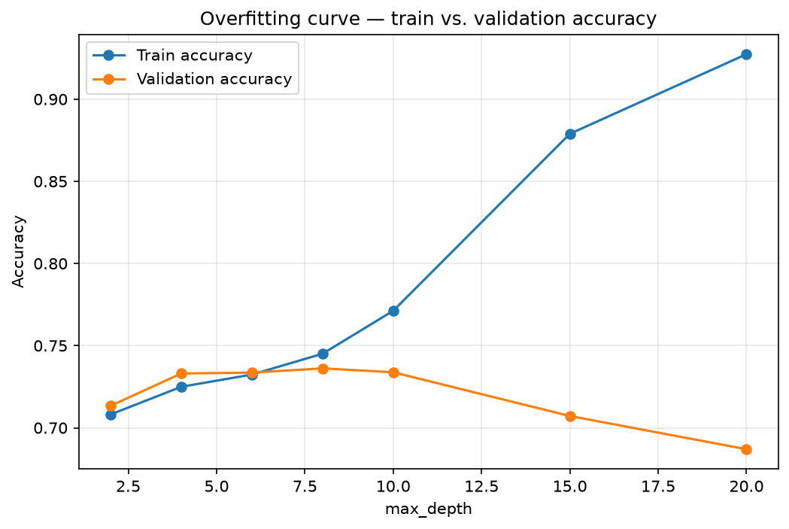

# Clarity
Chrome extension that highlights the most important sentences on any page, powered by a random forest model

## How it works

The pipeline runs from raw text → a trained model → live highlighting in the browser.

1. **Training data** — ~27k sentences labeled for *clarity*, collected via the MediaWiki API: Simple English Wikipedia (clear → label 1) vs. regular English Wikipedia (complex → label 0). Pairing the same topics makes the label about *how* something is written, not what it's about.
2. **Feature extraction** — each sentence becomes 5 readability numbers: word count, average word length, average syllables, rare-word ratio, and a length score. These are written identically in Python and JavaScript so training and in-browser inference agree exactly.
3. **Train the model** — a Random Forest classifier (~0.74 validation accuracy), plus an *overfitting experiment* that sweeps tree depth to show train vs. validation accuracy diverge (see the curve below).
4. **Export to ONNX** — convert the scikit-learn model to ONNX so it runs client-side in the browser via `onnxruntime-web`, with no server.
5. **Build the Chrome extension** — a content script splits the article into sentences, scores each one, then ranks by *importance* (how many of the article's recurring terms it carries) with a boost for definitions, and highlights the top sentences.
6. **Load and test** — load the `extension/` folder unpacked in Chrome and open any article.

> Note: "clarity" and "importance" are two different things. The model learns clarity (readability); importance is computed in the extension by term salience across the whole article. Together they pick sentences that are both easy to read and worth reading.

## Overfitting curve

Generated by `ml/src/train.py`. As `max_depth` grows, the Random Forest starts
to *memorize* the training set — train accuracy climbs toward 0.93 — while
validation accuracy peaks around 0.74 at `max_depth=8` and then **falls** to
~0.69 by `max_depth=20`. The widening gap between the two lines is overfitting
made visible. The shipped model uses a shallow `max_depth=6` with
`min_samples_leaf=5`, near the validation peak where the gap is small. 